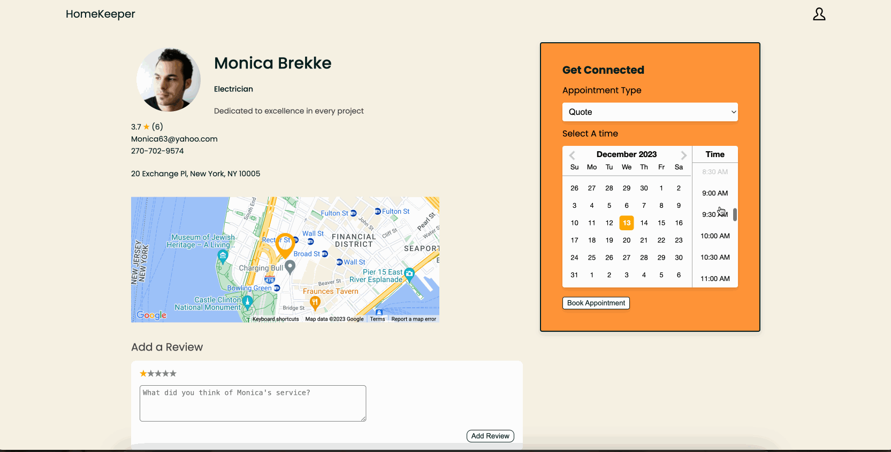

# HomeKeeper

HomeKeeper is designed to streamline the process of finding and booking contractors. This intuitive platform enhances user experience by allowing the reading and writing of detailed reviews about the contractors. This feature-rich app serves as a one-stop solution for efficiently managing interactions with various service providers across multiple fields. 
https://home-keeper.com/  
https://home-keeper.com/AboutUs

## Features

### Show Page (Google Maps API)

The Show Page feature of HomeKeeper, powered by the Google Maps API, enhances user navigation with a clear, interactive map pinpointing contractors' exact locations. This user-friendly interface offers a seamless browsing experience, ensuring users can effortlessly locate the services they need.

### Appointment Booking

HomeKeeper's Appointment Booking system provides a straightforward and efficient way to schedule services with contractors. With just a few clicks, users can book, modify, or cancel appointments, streamlining the process of managing service schedules with a reactive calendar API.

### Reviews

The Reviews feature empowers users to share their experiences by submitting reviews on contractor profiles. This functionality also allows users to read feedback from others, fostering a transparent and informed decision-making process.

### Reactive Search

The Search tool enhances the user's ability to discover contractors. As users type, the contractor list dynamically updates upon each keystroke, offering real-time search results and an improved user experience.

## Technologies
+ Frontend: React, Redux, Javascript, HTML, and CSS
+ Backend: Express, Mongoose, Node.js
+ Database: MongoDB
+ Services: Raspberry Pi, Google Maps API, Calendar API

## Future Prospects
+ add frontend and styles for DocuSign and CRUD for contracts
+ add CRUD for profile
